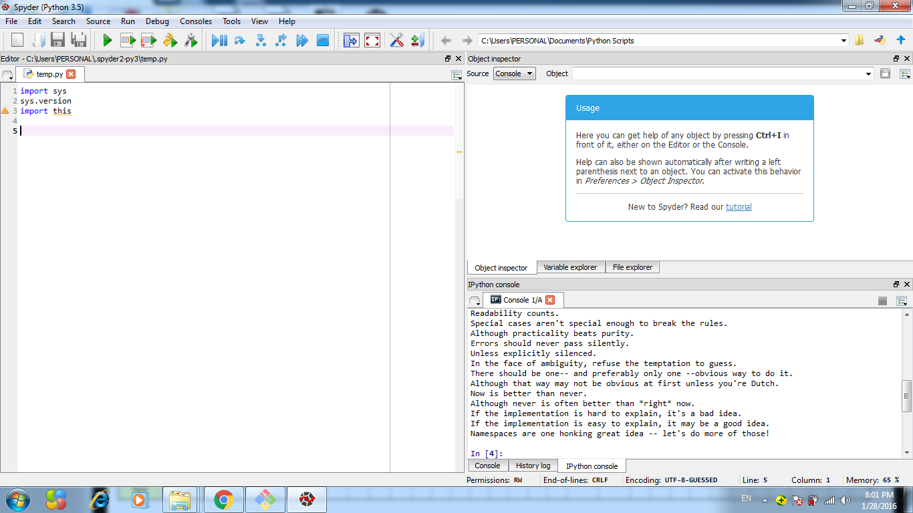

UECM3033 Assignment #1 Report
========================================================

- Prepared by: ** Tan Hong Wee**
- Tutorial Group: T3

--------------------------------------------------------

## Task 1 -- setup a github repository

The reports, codes and supporting documents are uploaded to Github at: 

[https://github.com/your_github_id/UECM3033_assign1](https://github.com/TanHongWee/UECM3033_assign1)

---------------------------------------------------------

## Task 2 -- setup python

Put here the screen shot of file (python.png)

------------------------------------------------------------

## Task 3 -- modify and run Python script

In this section, please report:

1. The hexadecimal value of your student ID.    
2. Write down the definite integrals that you have chosen.
3. Write down your system of 10 linear equations.

 1. 0x126153

 2. $$\int_0^{\int_100} e^{x^2} dx = \frac{\sqrt{\pi*erfi(100)}}{2}.$$

 3. \begin{align*}
   4 x_0 +x_2 &= 10,\\
   2 x_0 + 3 x_1 &= 9.
   \end{align*}

-----------------------------------

last modified: 28/1/2016
